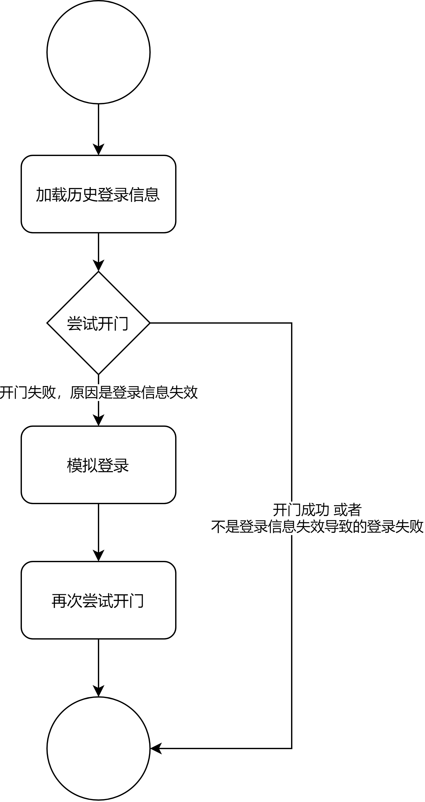

# spider

## 《守望领域》APP开门脚本

该脚本用来模拟《守望领域》APP的开门和登录请求。配置好参数运行该脚本，可以开启拥有权限的门禁。

### 流程图

## 抢洗衣机的脚本

目前抓取的是U净洗衣的微信公众号登录。已经成功模拟登录流程。用户只需要输入手机号和收到的验证码即可。

直接在创建订单外层嵌套一层循环或者多线程即可开始抢洗衣机

## 北邮第二课堂爬虫

需要首先在手机上登录第二课堂，之后点击活动的抢票按钮，获取两个登录凭证字段。将字段填入代码之后即可运行程序抢票。

## 选课爬虫

- Done
    - 查询当前选课系统中哪些课程还有余量
    - 如果其中有想选的课程，则执行选课请求
    - 如果没有选择到目标课程则不停循环。
    
## 查询空教室

基于[链接](http://where-to-sleep.name1e5s.com/)实现的一个爬虫

- Done
    - `day`表示的是周几，修改该值可以获得一周每天的课表
    - 程序会遍历查询1到14周的课程安排，获得一周内某一天的上午，下午，晚上三个时间段的无课教室

## ~~查成绩~~(不确定是否能用)
·
- Done
   - 每次调用程序会登陆教务系统获取最新的本学期成绩
   - 将获得的成绩中发布的成绩个数与result.txt中保存的成绩个数进行比较，如果不同说明成绩有更新，将会把成绩信息构成一个邮件，发送给设定好的邮箱
   - 每次调用无论成绩改变与否，都会输出调用时间和成绩信息
   - 可以结合linux服务器中的crontab命令实现每隔一个小时调用一次，将输出的时间和成绩信息存入日志文件
