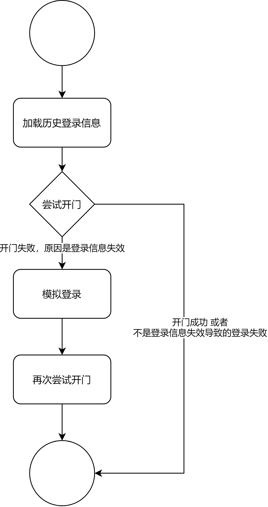

# Spider - 多功能爬虫工具集

[](https://www.python.org/)
[](LICENSE)
[](https://github.com/shaojunying/Spider/graphs/commit-activity)

一个功能丰富的Python爬虫工具集，包含房源信息、体育赛事数据、校园服务等多个模块的自动化数据采集工具。

## ✨ 特性

- 🏗️ **统一架构**: 基于公共模块的可扩展架构
- 🔄 **自动重试**: 内置HTTP请求重试和错误处理机制
- 📊 **多格式输出**: 支持CSV、Excel、JSON等多种数据格式
- 🚦 **智能限流**: 内置请求延迟和反反爬虫机制
- 📝 **完整日志**: 统一的日志记录和错误追踪
- 🔧 **易于扩展**: 基于基类的插件化开发模式

## 🏗️ 项目架构

```
Spider/
├── common/                      # 🎯 公共模块
│   ├── logger.py               # 统一日志配置
│   ├── http_client.py          # HTTP请求客户端
│   ├── utils.py                # 通用工具函数
│   └── base_scraper.py         # 基础爬虫类
├── house_buy/                   # 🏠 房源数据爬虫
├── sport/                       # ⚽ 体育赛事数据 (46+个项目)
├── hospital/                    # 🏥 医院挂号脚本
├── laundry-machine/             # 🧺 洗衣机预约
├── course_selection/            # 📚 选课脚本
├── check_course_result/         # 📊 成绩查询
├── check_empty_classroom/       # 🏫 空教室查询
├── bupt_second_class_ticket/    # 🎫 第二课堂抢票
├── house_door/                  # 🚪 门禁控制
├── github-oauth2/               # 🔐 GitHub OAuth2认证
├── gym.py                       # 💪 健身房预约
├── pdf/                         # 📄 PDF文档处理
├── shell/                       # 🐚 Shell脚本工具
├── io-multiplexing/             # ⚡ IO多路复用示例
├── test/                        # 🧪 测试脚本
├── byr-bbs/                     # 💬 BYR论坛相关
├── spider_for_finance.py        # 💰 财经数据爬虫
└── requirements.txt             # 📦 依赖管理
```

## 🚀 快速开始

### 安装依赖

```bash
pip install -r requirements.txt
```

### 基础使用

#### 1. 使用公共组件

```python
from common import get_logger, HttpClient, save_to_csv

# 统一日志
logger = get_logger('my_scraper', 'output')

# HTTP客户端
with HttpClient(delay_range=(1, 3)) as client:
    response = client.get('https://example.com')
    data = response.json()

# 保存数据
save_to_csv(data, 'output/data.csv')
```

#### 2. 继承基础爬虫类

```python
from common.base_scraper import SportScraper

class MyScraper(SportScraper):
    def scrape(self):
        # 实现具体爬虫逻辑
        return data

# 运行
scraper = MyScraper()
data = scraper.run(save_format='xlsx')
```

## 📦 功能模块

### 🏠 房源信息爬虫 (`house_buy/`)

监控房源价格变化，支持多个小区数据采集和历史价格分析。

**功能特点:**
- 🔍 多小区房源信息采集
- 📈 历史价格趋势分析  
- 🤖 反爬虫验证码处理
- 📊 数据可视化支持

**使用示例:**
```python
# 使用重构版本
python house_buy/anjuke_refactored.py
```

### ⚽ 体育赛事数据 (`sport/`)

采集46+个体育项目的赛事数据，包括体操、游泳、网球等。

**支持项目:**
- 🤸 体操 (Gymnastics)
- 🏊 游泳 (Swimming/FINA)
- 🎾 网球 (ATP/WTA/ITF)
- 🏐 排球 (Volleyball)
- 🏹 射箭 (Archery)
- ⛷️ 滑雪 (FIS)
- 等等...

**使用示例:**
```python
# 体操数据采集 (重构版本)
python sport/py/1.gymnastics_refactored.py
```

### 🏥 医院挂号脚本 (`hospital/`)

自动化医院预约挂号，支持多线程并发预约。

### 🧺 洗衣机预约 (`laundry-machine/`)

U净洗衣微信公众号自动预约脚本，支持验证码识别。

### 📚 校园服务

#### 选课脚本 (`course_selection/`)
- ✅ 自动查询课程余量
- ✅ 自动选课
- ✅ 循环监控直到选课成功

#### 成绩查询 (`check_course_result/`)
- ✅ 自动登录教务系统
- ✅ 成绩变化邮件通知
- ✅ 支持定时任务 (crontab)

#### 空教室查询 (`check_empty_classroom/`)
- ✅ 查询1-14周课程安排
- ✅ 按时间段筛选空教室
- ✅ 支持多校区查询

#### 第二课堂 (`bupt_second_class_ticket/`)
- ✅ 自动抢票功能
- ✅ 支持多活动监控

### 🚪 门禁控制 (`house_door/`)

《守望领域》APP门禁模拟脚本，支持权限验证和远程开门。



### 💰 财经数据 (`spider_for_finance.py`)

财联社快讯数据采集，支持实时金融资讯抓取。

### 🔐 GitHub OAuth2认证 (`github-oauth2/`)

GitHub OAuth2认证服务器实现，支持GitHub应用授权登录。

### 💪 健身房预约 (`gym.py`)

健身房自动预约脚本，支持多线程并发预约多个时间段。

### 📄 PDF文档处理 (`pdf/`)

PDF文档内容抓取和处理工具，支持批量PDF文件解析。

### 🐚 Shell脚本工具 (`shell/`)

Shell脚本相关工具集，包含文本处理和数据提取功能。

**功能特点:**
- ✅ 提取指定分隔符之间的内容
- ✅ CSV格式数据处理
- ✅ 批量文本处理

### ⚡ IO多路复用示例 (`io-multiplexing/`)

网络编程IO多路复用的客户端和服务器示例代码。

### 🧪 测试脚本 (`test/`)

项目测试脚本集合，包含2FA认证和课程相关测试。

**包含功能:**
- `2fa.py` - 双因子认证(TOTP)生成器
- `course.py` - 课程相关功能测试

### 💬 BYR论坛相关 (`byr-bbs/`)

北邮人论坛相关功能模块(暂时为空，预留扩展)。

## 🛠️ 开发指南

### 创建新的爬虫

1. **继承基础类:**
```python
from common.base_scraper import BaseScraper

class MyNewScraper(BaseScraper):
    def __init__(self):
        super().__init__(name="my_scraper")
    
    def scrape(self):
        # 实现爬虫逻辑
        return data
```

2. **使用公共组件:**
- `get_logger()` - 统一日志
- `HttpClient()` - HTTP请求
- `save_to_csv()` - 数据保存
- `normalize_price_text()` - 价格文本处理

### 配置管理

每个模块的配置文件格式：
```python
# config.py.example -> config.py
API_KEY = "your_api_key"
BASE_URL = "https://api.example.com"
OUTPUT_DIR = "output"
```

## 📋 项目重构

项目经过全面重构，解决了以下问题：
- ❌ 13个文件重复日志配置 → ✅ 统一日志模块
- ❌ 47个文件重复HTTP请求代码 → ✅ 统一HTTP客户端
- ❌ 46个sport脚本结构混乱 → ✅ 基于基类的统一架构

详细信息请参考: [📖 重构指南](REFACTOR_GUIDE.md)

## 📊 数据输出

支持多种数据格式：
- **CSV**: 适合数据分析
- **Excel**: 适合报表展示  
- **JSON**: 适合API集成
- **日志**: 完整的运行记录

输出目录结构：
```
output/
├── logs/              # 日志文件
├── *.csv             # CSV数据文件
├── *.xlsx            # Excel数据文件
└── *.json            # JSON数据文件
```

## ⚠️ 使用须知

1. **遵守网站robots.txt和使用条款**
2. **合理设置请求频率，避免对目标网站造成负担**
3. **不要将配置文件提交到版本控制系统**
4. **某些功能需要相应的权限和凭证**

## 🤝 贡献指南

1. Fork 本仓库
2. 创建特性分支 (`git checkout -b feature/AmazingFeature`)
3. 提交更改 (`git commit -m 'Add some AmazingFeature'`)
4. 推送分支 (`git push origin feature/AmazingFeature`)
5. 创建 Pull Request

## 📄 许可协议

本项目采用 MIT 许可协议 - 查看 [LICENSE](LICENSE) 文件了解详情。

## 📞 联系方式

- GitHub: [@shaojunying](https://github.com/shaojunying)
- 项目链接: [https://github.com/shaojunying/Spider](https://github.com/shaojunying/Spider)

## 🙏 致谢

感谢所有为此项目做出贡献的开发者和用户。

---

**⚡ 提示**: 如果你觉得这个项目有用，请给它一个 ⭐ Star！
